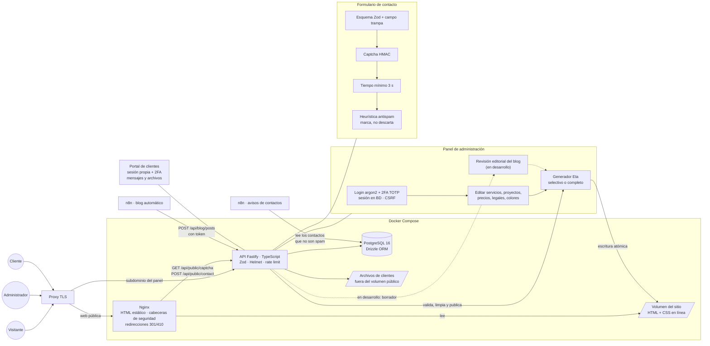

# Web de circo estudio · generación estática, Fastify y PostgreSQL

**En vivo:** https://circoestudio.com

> **Proyecto propio de circo estudio.** La web del estudio, hecha a medida: páginas estáticas que sirve Nginx, un panel de administración que las regenera al guardar, un formulario de contacto con defensas propias, un blog que se alimenta desde n8n y un portal privado para clientes. Incluye [fragmentos del código real](snippets/), recortados.

## El problema

La web anterior era un WordPress. Para un estudio que vende webs rápidas y automatización, eso tenía varios costes:

- **dependía de plugins** para cosas básicas (formularios, caché, SEO, seguridad), cada uno con sus actualizaciones y su superficie de ataque;
- **cada visita ejecutaba PHP y consultas** para servir páginas que casi nunca cambian;
- y no había sitio para lo que el estudio necesitaba además de la web: un **portal para clientes**, un **blog automatizado** y un **formulario** que filtrara el spam sin perder contactos reales.

## La solución

Una web **estática en lo público y dinámica solo donde hace falta**:

1. **Páginas públicas en HTML estático**, generadas con plantillas Eta y servidas por Nginx. No hay base de datos en el camino de una visita.
2. **Una API en Fastify** con dos caras: el panel de administración (en su propio subdominio) y los dos únicos puntos dinámicos de la web pública, el **formulario de contacto** y su **captcha**.
3. **Un panel** desde el que se editan servicios, proyectos, precios, testimonios, pagos, textos legales y los colores de la marca. Al guardar, **se regeneran solo las páginas afectadas**.
4. **Un blog alimentado por n8n**: el [flujo automático](https://github.com/lucassebastiang/blog-automatico-ia) envía cada artículo a la API, que lo valida, lo limpia y **lo publica solo**, regenerando el sitio. En desarrollo: que entre como borrador y se revise en el panel antes de salir.
5. **Un portal de clientes** con su propia sesión y 2FA, mensajes y archivos privados.
6. **Redirecciones del WordPress antiguo**: cada URL vieja lleva a su equivalente con un 301 o devuelve un 410 si ya no existe.

## Arquitectura

## Decisiones técnicas

### Estático en lo público, dinámico solo donde hace falta
Una visita a la web es un fichero HTML servido por Nginx: no pasa por Node ni por la base de datos. Lo único dinámico de la parte pública son el formulario y su captcha, que Nginx reenvía a la API por dos rutas exactas.

- **Rápido y barato de servir:** no hay nada que calcular por visita.
- **Menos superficie de ataque:** la API no está expuesta en el dominio principal salvo en esas dos rutas.
- **Si la API se cae, la web sigue en pie.** Solo dejarían de funcionar el formulario y el panel.

→ [snippets/nginx-sitio.conf](snippets/nginx-sitio.conf)

### El panel regenera solo lo que cambia
Cada tipo de contenido sabe qué páginas le afectan. Guardar un proyecto regenera su ficha, el listado de proyectos, la portada y las páginas de sus servicios. Guardar un precio, la página de precios, la portada y el servicio correspondiente. Los ajustes globales (colores, datos de contacto) regeneran todo. Cada regeneración queda registrada con el número de páginas y lo que ha tardado.

### Regenerar sin dejar la web a medias
La regeneración completa no escribe encima de lo que se está sirviendo. Construye el sitio en una carpeta temporal **dentro** del volumen (en Docker, el volumen es un punto de montaje y no se puede renombrar) y cambia las entradas una a una con renames, que son instantáneos. Las páginas sueltas se escriben en un `.tmp` y se renombran. Nginx nunca sirve un HTML a medio escribir.

→ [snippets/generacion-estatica.ts](snippets/generacion-estatica.ts)

### CSS en línea y JavaScript mínimo
Cada página lleva su CSS dentro del HTML: los tokens de la marca, la base, los componentes y el de la página. No hay hojas de estilo que bloqueen el pintado. El JavaScript son módulos pequeños sin framework ni empaquetador, y cada página carga solo los suyos.

El chatbot (Typebot autoalojado) es lo más pesado, y **solo se descarga si el visitante acepta las cookies**. La analítica funciona igual: Google Tag Manager se carga después del consentimiento, con Consent Mode v2.

### Un formulario que filtra sin perder contactos
El formulario tiene varias capas, de más barata a más fina:
1. **Esquema con Zod** y un **campo trampa** que un humano no ve y debe llegar vacío.
2. **Captcha propio**: una suma firmada con HMAC que caduca a los 10 minutos. Se verifica sin sesión, sin base de datos y sin servicios externos.
3. **Tiempo mínimo**: si se envía en menos de 3 segundos, se rechaza.
4. **Límite de peticiones**: 5 envíos por hora e IP.
5. **Heurística antispam** (enlaces, frases típicas de spam de SEO y loterías, mensajes casi en mayúsculas). Esta capa **marca, no descarta**: el contacto se guarda igual y se puede revisar en el panel. Un falso positivo no cuesta un cliente.

Cada envío lleva además un identificador único, así que reintentar después de un corte de conexión no duplica el contacto.

→ [snippets/antispam.ts](snippets/antispam.ts) · [snippets/captcha-hmac.ts](snippets/captcha-hmac.ts)

### Avisos de contactos por cola, no por correo directo
El formulario solo **guarda** el contacto. Un flujo de n8n lee los contactos que no son spam y registra cada aviso entregado. Si un envío falla, el contacto sigue pendiente y se reintenta en la siguiente pasada. El envío por SMTP desde la propia API queda como respaldo configurable.

### Panel y portal con 2FA de verdad
- **Contraseñas con argon2id** y cambio obligatorio en el primer inicio de sesión.
- **Sesiones en PostgreSQL** con cookie `httpOnly`, `Secure` y `SameSite=Lax`, y un **token CSRF por sesión** en todas las acciones del panel.
- **2FA con TOTP** (Google Authenticator y compatibles) y **8 códigos de recuperación** de un solo uso, de los que solo se guarda el hash. El QR se genera en el servidor como data-URI, porque la CSP del panel no permite cargar nada externo.
- **Límites de intentos**: 5 inicios de sesión y 8 códigos cada 15 minutos.
- **Cabeceras de seguridad** con Helmet en el panel (CSP estricta, `frame-ancestors 'none'`, HSTS) y en Nginx para la web.

El portal de clientes usa el mismo esquema con sesión y cookie propias. Sus archivos viven **fuera** del volumen que sirve Nginx: se guardan con un nombre aleatorio y solo se descargan por una ruta autenticada.

→ [snippets/2fa-totp.ts](snippets/2fa-totp.ts)

### El blog se publica solo, pero la API no se fía
La API del blog exige un token en cabecera, valida el artículo con Zod, **limpia el HTML** con una lista cerrada de etiquetas, rechaza textos demasiado cortos o con frases que delatan una respuesta rota del modelo («como modelo de lenguaje»…) y deja un aviso en el log si la foto de Unsplash ya se ha usado en otro artículo. n8n hace sus propias comprobaciones antes; estas son una segunda barrera. Si todo pasa, el artículo **se publica solo** y se regenera el sitio.

**En desarrollo:** que cada artículo entre como **borrador** y, para publicarlo, haya que abrirlo en el panel y confirmar que se han revisado los datos, los precios, las fuentes y las imágenes.

### Migrar sin perder lo posicionado
Las URLs del WordPress antiguo tienen un mapa en Nginx: las que tienen equivalente responden con un **301** a la página nueva, y las que ya no existen, con un **410**, que le dice a Google que las olvide en lugar de seguir probando.

### Todo en contenedores, sin root
Tres contenedores con Docker Compose: Nginx, la API y PostgreSQL, en una red interna. La imagen de la API se construye en varias etapas sobre `node:22-alpine`. Al arrancar aplica las migraciones, carga los datos iniciales solo si la base está vacía, genera el sitio y arranca la API, **todo como un usuario sin privilegios**. Solo el ajuste de permisos de los volúmenes se hace como root.

## Calidad

- **Playwright + axe-core** en todas las páginas: el objetivo es **cero incidencias críticas o graves** de accesibilidad.
- **Capturas con Playwright** de cada página a 360, 768, 1024 y 1440 px, para revisar el diseño en todos los tamaños.
- **html-validate** con las reglas recomendadas.
- **ESLint** con las reglas de TypeScript en la API, y **Prettier** para el formato.
- **Comprobaciones de SEO** con Playwright sobre las páginas publicadas: que respondan 200 y sin errores de JavaScript en móvil y escritorio.

### Peso de la web
Medido sobre el código del proyecto, sin minificar (el JavaScript se sirve tal cual):

| | Sin comprimir | Con gzip |
|---|---|---|
| JavaScript común a todas las páginas (5 módulos) | 7,8 KB | 3,6 KB |
| JavaScript total de la portada | 12,5 KB | 5,9 KB |
| JavaScript total de la página de contacto | 14,5 KB | 6,3 KB |
| Hojas de estilo externas | 0 | 0 |
| Fuente (una sola variable, woff2) | 90 KB | — |
| Chatbot, **solo tras aceptar cookies** | 689 KB | 197 KB |

## Cómo se construyó

Con Claude Code como asistente de programación, a partir de un documento de contexto del proyecto y por fases, con revisión mía en cada paso.

## Stack

- **Web:** HTML estático generado con Eta, CSS propio con tokens, JavaScript en módulos sin framework.
- **API:** Node 22, TypeScript, Fastify 5, Zod, Drizzle ORM, argon2, otplib, sanitize-html, sharp, nodemailer.
- **Datos:** PostgreSQL 16.
- **Servidor:** Nginx en Alpine, Docker Compose, detrás de un proxy TLS.
- **Integraciones:** n8n (blog y avisos de contactos), Typebot autoalojado, Google Tag Manager con Consent Mode v2.
- **Calidad:** Playwright, axe-core, html-validate, ESLint y Prettier.

## Estado actual

- **En producción** en https://circoestudio.com.
- Panel de administración, portal de clientes con 2FA, formulario con antispam y blog conectado a n8n, que publica solo.
- **En desarrollo:** la revisión editorial del blog, con borrador antes de publicar.

## Lo que he aprendido

- **Lo estático no es una limitación si el panel regenera por ti.** Quien edita no ve ficheros HTML: guarda un precio y la web cambia. La complejidad se queda en el generador, no en cada visita.
- **Filtrar el spam no puede costar clientes.** Por eso la heurística marca en lugar de descartar: prefiero revisar un falso positivo que perder un contacto real.
- **Las defensas baratas van primero.** Un campo trampa, una suma firmada y un tiempo mínimo frenan a los bots genéricos sin molestar a nadie ni depender de terceros.
- **Escribir encima de lo que se sirve es buscarse problemas.** Construir aparte y cambiar con renames es poco código y evita páginas rotas a mitad de una regeneración.
- **Si algo se publica solo, necesita más de una barrera.** El blog llega desde n8n ya validado y la API vuelve a comprobarlo. El siguiente paso, en desarrollo, es que publicar vuelva a ser una decisión: la IA escribe el borrador y yo decido si sale.
